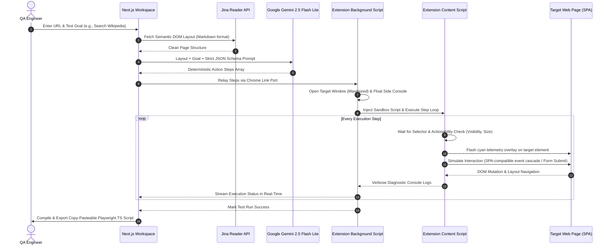

# 🧞 Testjin: Zero-Infrastructure QA Automation Workbench & AI Web Agent

**Testjin** is a lightweight, agentic QA automation workbench. It translates natural language prompts into production-ready E2E Playwright test scripts and executes them directly against live browser tabs—completely bypassing the need for cloud virtual machines, heavy Playwright server infrastructure, or complex CI runner environments.

---

## 🏗️ Decoupled Architecture

Testjin operates on a clean, event-driven decoupled architecture. It separates the **AI Planning & Layout Reader** from the **Headless DOM Execution Sandbox**:



---

## 💎 Technical Highlights & Deep-Dive

### 1. The Command Center (Next.js / Vercel Edge)
- **AI Planning Engine:** Uses Google Gemini's **`gemini-2.5-flash-lite`** model configured with `responseMimeType: 'application/json'` to enforce a deterministic JSON Schema output of step actions.
- **Layout Reader:** Passes target web pages through the Jina Reader API (`https://r.jina.ai/`) to strip heavy asset bundles and return a lightweight, semantic Markdown representation of the page layout.
- **Playwright TS Compiler:** A built-in code generator that translates the successful JSON steps back into standard Playwright TypeScript code, with string escaping and `{enter}` key command conversions mapped to idiomatic `.fill()` and `.press('Enter')` calls.

### 2. The Execution Engine (Manifest V3 Chrome Extension)
- **Cypress-Style `{enter}` Command Parser:** Automatically intercepts `{enter}` commands appended to values in text fields, strips the modifier, types the value, and dispatches the native keyboard events. If the field is nested in a form, it falls back to a native `HTMLFormElement.prototype.submit.call(form)` execution path to bypass Vue/React `submit.prevent` overrides.
- **SPA Synthetic Event Cascade:** Modifies browser prototypes to bypass React/Vue's setter overrides. Triggers full event loops (`input` -> `change` -> `keydown` -> `keyup` -> `blur`) so that framework state bindings update naturally as if driven by a human.
- **Actionability & Visibility Checks:** Prioritizes standard CSS selectors but checks viewport bounds (`rect.width > 2`, `rect.height > 2`, `rect.left >= -10`, `rect.top >= -10`), visibility tags, and display styling to filter out offscreen analytics tokens, hidden fields, and ghost screen-reader inputs.
- **Smart DOM Fallbacks:** Intercepts selector failures. Automatically resolves Playwright pseudo-selectors like `:has-text(...)` and evaluates XPath matches. It features fuzzy fallbacks for forms, resolving standard search inputs (`type="search"`, `name="search"`, `placeholder*="search"`) and buttons even if the AI hallucinates specific attribute selectors.
- **Real-Time Visual Telemetry:** Before executing any interaction, the content script renders a bright cyan (`#00ffcc`) bounding glow directly over the targeted DOM element, showing the engineer exactly what the AI agent is focusing on.

### 3. Split-Screen Floating Inspector Layout
Using the Chrome `system.display` API, Testjin automatically computes screen geometry upon execution. It triggers a dual-window environment:
- Spawns the target test browser window maximized in the background, ensuring CSS media queries render in full desktop mode.
- Pins the Testjin Control Center sidebar to the right edge of the screen as a narrow floating window (`width: 450px`), providing a dedicated, real-time diagnostic console.

### 4. Incognito Workspace Isolation
Launches target test sessions in **Incognito mode** (with a graceful standard-window fallback if the permission is not toggled). This isolates tests from cached cookies, active sessions, password managers, and third-party extension overlays, ensuring a clean-room automation sandbox.

---

## ✨ Interactive Guided Tour: "Try an Example"

To demonstrate Testjin's capabilities immediately without configuration, the web UI features three preloaded testing tracks:
1. 🛒 **SwagLabs:** Log in, simulate adding products to a shopping cart, and verify item badges.
2. 🔐 **Herokuapp:** Interactive test for classic form authentication, checking error banners, and verifying click-to-dismiss panels.
3. 🔎 **Wikipedia:** Enters complex queries into Wikipedia's search input and submits via `{enter}` to bypass JavaScript-heavy autocomplete traps.

The app uses a guided assistant banner with glowing pulsing prompts (`tour-pulse-active`) to walk users through the entire **Generate -> Execute -> Export** pipeline.

---

## 🚀 Installation & Local Setup

Because Testjin uses a Manifest V3 browser extension to communicate across tabs and bypass strict CORS headers, you must run it locally:

### Step 1: Install the Chrome Extension
1. Clone this repository.
2. Open Google Chrome and navigate to `chrome://extensions/`.
3. Toggle **Developer mode** on (top-right corner).
4. Click **Load unpacked** (top-left corner) and select the `extension` folder in this repository.
5. Note the generated **Extension ID** on the card.
6. **Critical Security Step:** Click **Details** on the Testjin card, and toggle **Allow in Incognito** to **ON**. (This enables the sandbox window isolation).

### Step 2: Configure & Run the Next.js Workspace
1. Open the project folder in your terminal.
2. Install the workspace dependencies:
   ```bash
   npm install
   ```
3. Create a `.env.local` file in the root directory and add your API keys:
   ```env
   # Google Gemini API Key (Enables AI Test Planner)
   GEMINI_API_KEY=your_gemini_api_key_here

   # Jina Reader API Key (Enables Layout Extraction)
   JINA_API_KEY=your_jina_api_key_here
   ```
4. Start the Next.js local development server:
   ```bash
   npm run dev
   ```
5. Open your browser and navigate to `http://localhost:3000` (or the console's active port).
6. Paste your **Extension ID** into the configuration input field and you are ready to automate!

---

## 🧑‍💻 Developer

**Josh Chamo**
- **Email:** joshchamo@gmail.com
- **GitHub:** [joshchamo](https://github.com/joshchamo)

